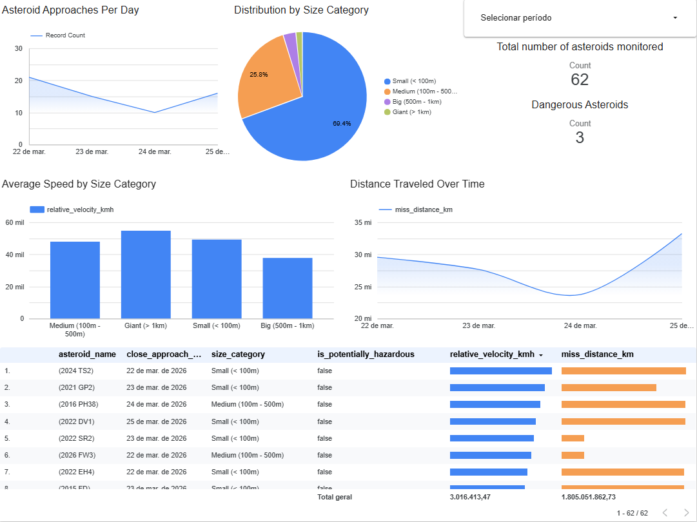

# NASA Asteroids Data Pipeline (NEOws) ☄️
> **Data Engineering Zoomcamp — Final Project**

An end-to-end data pipeline that extracts Near Earth Object (NEO) data 
from NASA's official API, processes it on the cloud, and generates 
strategic visualizations about asteroid risks and characteristics.

---

## 🏗️ Architecture

1. **Infrastructure (IaC):** GCP provisioned via **Terraform**
2. **Orchestration:** **Mage AI** running in a **Docker** container
3. **Data Lake:** **Google Cloud Storage** — raw data in **Parquet** format
4. **Data Warehouse:** **BigQuery** — partitioned and clustered tables
5. **Transformation:** **dbt Cloud** — Staging and Core layers
6. **Visualization:** **Looker Studio**

---

## 🛠️ Tech Stack

| Layer | Technology |
|---|---|
| Language | Python 3.10+, SQL |
| Cloud | Google Cloud Platform (GCS, BigQuery, IAM) |
| IaC | Terraform |
| Container | Docker & Docker Compose |
| Orchestration | Mage AI |
| Transformation | dbt Cloud |
| Visualization | Looker Studio |

---

## 📊 Data Warehouse Design

The final BigQuery table is optimized with:

- **Partitioning:** By `close_approach_date` (daily)
  - *Why:* The dashboard filters by approach date — partitioning prevents 
    full table scans, processing only the selected days.
- **Clustering:** By `is_potentially_hazardous`
  - *Why:* This is the primary categorical filter. Clustering groups 
    similar data together, speeding up risk-based aggregations.

---

## 🚀 How to Run

### Prerequisites
- GCP account with a Service Account (JSON) with Editor permissions
- Docker and Terraform installed locally
- NASA API key from [api.nasa.gov](https://api.nasa.gov)

### 1. Infrastructure
```bash
cd terraform
terraform init
terraform apply
```

### 2. Ingestion (Mage AI)
1. Set your `.env` file with `NASA_API_KEY` and GCP credentials
2. Start Mage: `docker compose up -d`
3. Open `localhost:6789` and run the `nasa_api_to_gcs` pipeline

### 3. Transformation (dbt)
1. Connect dbt Cloud to your BigQuery project
2. Run the models: `dbt run`

---

## 📈 Dashboard



🔗 [View live dashboard](https://lookerstudio.google.com/reporting/3b138cf5-c987-433b-b4fc-ecc04a6e1239)

---

*Developed by Symon Mantovani as the final project for Data Engineering Zoomcamp 2026.*
